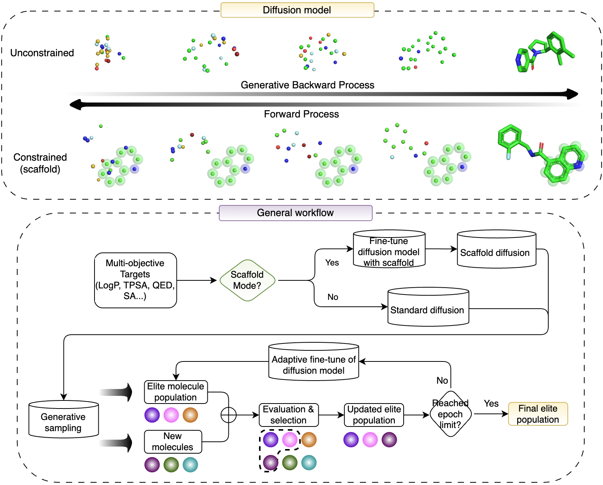

# EvoDiffMol: Evolutionary Diffusion Framework for 3D Molecular Design with Optimized Properties

<p align="center">
  
</p>

**EvoDiffMol** is a Python package for generating 3D molecules with optimized properties using **genetic algorithms** and **diffusion models**. It combines the power of:
- **Diffusion Models** for high-quality 3D molecular structure generation
- **Genetic Algorithms** for multi-objective property optimization
- **Scaffold Constraints** for drug discovery applications

Generate drug-like molecules optimized for multiple properties (QED, LogP, SA, TPSA) simultaneously!

## 📋 Table of Contents
- [Features](#-features)
- [Installation](#-installation)
- [Quick Start](#-quick-start)
- [Examples](#-examples)
- [Training](#-training)
- [Testing](#-testing)
- [Citation](#-citation)

## ✨ Features

- **Diffusion-based 3D molecule generation** with state-of-the-art quality
- **Genetic algorithm optimization** for multi-property molecular design
- **Scaffold-constrained generation** for drug discovery
- **Easy-to-use API** with comprehensive examples
- **Production-ready** with extensive tests

## 🚀 Installation

### Prerequisites

- Python >= 3.8
- CUDA-capable GPU (recommended)
- Conda or virtualenv

### Method 1: Install from source (Recommended)

```bash
# Clone the repository
git clone https://github.com/your-org/EvoDiffMol.git
cd EvoDiffMol

# Create conda environment
conda create -n evodiff python=3.10
conda activate evodiff

# Install PyTorch with CUDA support (adjust for your CUDA version)
conda install pytorch torchvision torchaudio pytorch-cuda=11.8 -c pytorch -c nvidia

# Install PyTorch Geometric
pip install torch-geometric torch-scatter torch-sparse torch-cluster -f https://data.pyg.org/whl/torch-2.0.0+cu118.html

# Install the package
pip install -e .
```

### Method 2: Install from requirements.txt

```bash
# Install dependencies
pip install -r requirements.txt

# Install package in development mode
pip install -e .
```

### Verify Installation

```bash
python -c "from evodiffmol import MoleculeGenerator; print('✓ EvoDiffMol installed successfully!')"
```

## 🎯 Quick Start

### Running Examples

The `examples/` folder contains ready-to-run scripts:

```bash
# Single property optimization (QED)
python examples/01_single_property.py

# Multi-property optimization (LogP, QED, SA)
python examples/02_multi_property.py

# Get results as DataFrame
python examples/03_dataframe_output.py

# Scaffold-constrained generation
python examples/04_scaffold_based.py
```

**Note:** Examples use `population_size=32` and `generations=3` for fast demonstration (~2-3 minutes each).

### Basic API Usage

```python
from evodiffmol import MoleculeGenerator
from evodiffmol.utils.datasets import General3D

# Load dataset (for metadata only)
dataset = General3D('moses', split='valid', remove_h=True)

# Initialize generator
gen = MoleculeGenerator(
    checkpoint_path="path/to/checkpoint.pt",
    model_config="configs/general_without_h.yml",
    ga_config="ga_config/moses_production.yml",
    dataset=dataset
)

# Optimize molecules
molecules = gen.optimize(
    target_properties={'qed': 0.9, 'logp': 2.5},
    population_size=100,
    generations=20,
    output_dir='results/optimization'
)

print(f"Generated {len(molecules)} optimized molecules")
```

## 📚 Examples

| Example | Description | Runtime |
|---------|-------------|---------|
| [`01_single_property.py`](examples/01_single_property.py) | Optimize for single property (QED) | ~2-3 min |
| [`02_multi_property.py`](examples/02_multi_property.py) | Multi-property optimization | ~2-3 min |
| [`03_dataframe_output.py`](examples/03_dataframe_output.py) | DataFrame analysis | ~2-3 min |
| [`04_scaffold_based.py`](examples/04_scaffold_based.py) | Scaffold constraints | ~3-4 min |
| [`05_property_exploration.py`](examples/05_property_exploration.py) | Compare targets | ~6-8 min |
| [`06_batch_processing.py`](examples/06_batch_processing.py) | Batch workflows | ~10-12 min |

See [`examples/README.md`](examples/README.md) for detailed documentation.

## 📊 Available Properties

| Property | Code | Range | Description |
|----------|------|-------|-------------|
| **QED** | `qed` | 0-1 | Drug-likeness (higher is better) |
| **LogP** | `logp` | -2 to 6 | Lipophilicity (2-3 typical for drugs) |
| **SA** | `sa` | 1-10 | Synthetic accessibility (lower is easier) |
| **TPSA** | `tpsa` | 0-200 | Polar surface area (60-140 for drugs) |

## 🔬 Training

### Dataset Preparation

#### MOSES Dataset (Recommended for drug-like molecules)
```bash
# Dataset will be automatically downloaded on first use
python -c "from evodiffmol.utils.datasets import General3D; General3D('moses', 'train', remove_h=True)"
```

#### QM9 Dataset
```bash
cd datasets/qm9/data/prepare/
python download.py
```

### Training from Scratch

```bash
# Train on MOSES dataset (without hydrogen)
python train.py \
    --config configs/general_without_h.yml \
    --logdir logs_moses \
    --remove_h

# Train on QM9 dataset
python train.py \
    --config configs/qm9_full_epoch.yml \
    --logdir logs_qm9
```

### Resume Training

```bash
python train.py \
    --config configs/general_without_h.yml \
    --logdir logs_moses \
    --resume_checkpoint logs_moses/checkpoints/50.pt \
    --resume_iter 50
```

## 🧪 Testing

### Run All Tests

```bash
# Install test dependencies
pip install pytest

# Run all tests
pytest tests/ -v

# Run specific test
pytest tests/test_api_basic.py -v

# Run with coverage
pytest tests/ --cov=evodiffmol --cov-report=html
```

### Test Categories

- `test_api_basic.py` - Basic API functionality
- `test_optimization.py` - GA optimization tests
- `test_formats.py` - Output format tests
- `test_scaffold.py` - Scaffold generation tests
- `test_3d_structure.py` - 3D structure validation
- `quick_test.py` - Quick smoke test

## 📦 Package Structure

```
EvoDiffMol/
├── evodiffmol/          # Main package
│   ├── ga/              # Genetic algorithm components
│   ├── models/          # Neural network models
│   ├── scoring/         # Molecular scoring functions
│   └── utils/           # Utilities and datasets
├── examples/            # Usage examples
├── tests/               # Test suite
├── configs/             # Model configurations
├── ga_config/           # GA configurations
├── datasets/            # Dataset utilities
├── train.py             # Training script
├── setup.py             # Package installer
└── requirements.txt     # Dependencies
```

## 🛠️ Configuration

### Model Config (`configs/`)
- `general_without_h.yml` - MOSES/GuacaMol without H
- `qm9_full_epoch.yml` - QM9 dataset
- `qm40_without_h.yml` - QM40 dataset

### GA Config (`ga_config/`)
- `moses_production.yml` - Production settings
  - Population: 250
  - Batch size: 128
  - Generations: 15

## 💡 Tips

### GPU Memory Issues
```python
# Reduce batch size
molecules = gen.optimize(
    target_properties={'qed': 0.9},
    batch_size=32,  # Lower if OOM
    ...
)
```

### Speed Optimization
```python
# Increase batch size (if GPU allows)
batch_size=128

# Generate fewer molecules per iteration
num_scale_factor=1.5  # Default: 2.0
```

## 📖 Documentation

- **Examples Guide:** [`examples/README.md`](examples/README.md)
- **API Reference:** `evodiffmol/design/API_REFERENCE.md`
- **Testing Guide:** `evodiffmol/design/TESTING_GUIDE.md`

## 🤝 Contributing

Contributions are welcome! Please:
1. Fork the repository
2. Create a feature branch
3. Add tests for new features
4. Submit a pull request

## 📄 License

This project is licensed under the MIT License - see LICENSE file for details.

---

**EvoDiffMol** - Evolutionary Diffusion Framework for 3D Molecular Design 🧬✨

